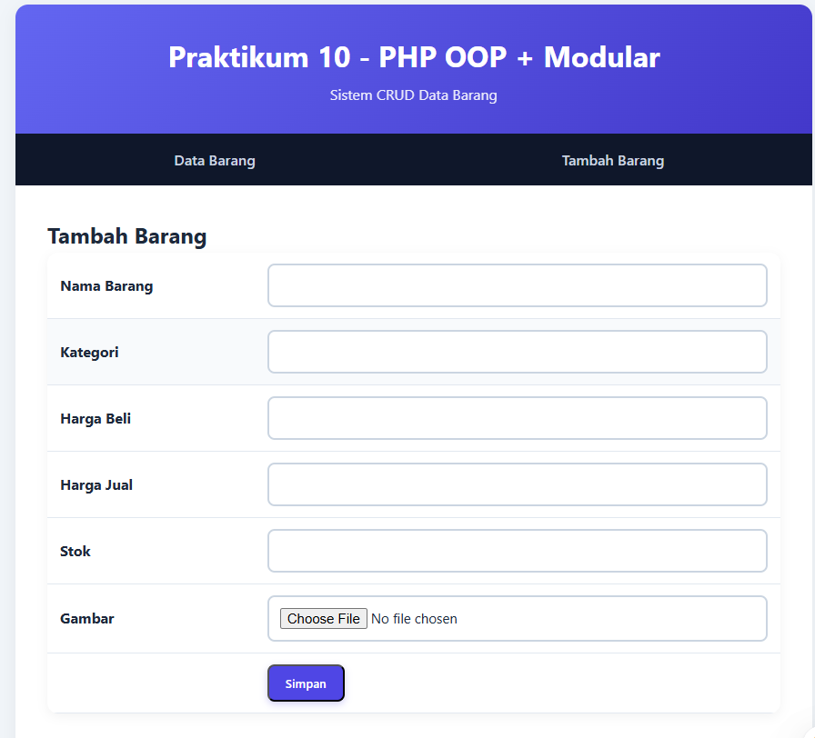
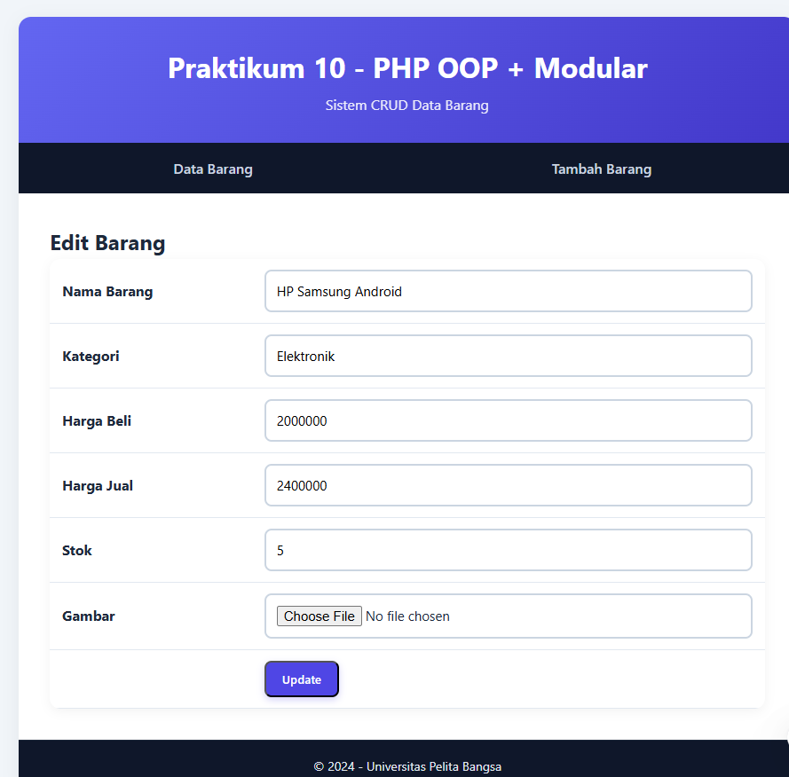
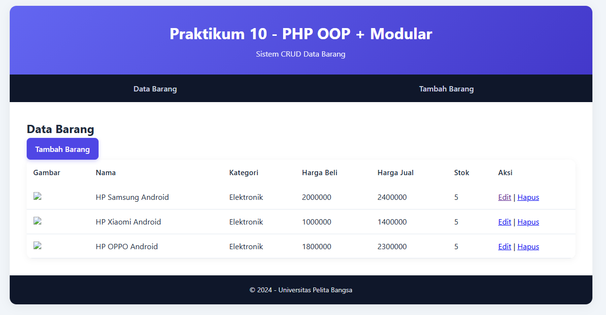

# 📘 README – Praktikum 10: Modularisasi & OOP PHP (Database Barang)


---

## 👤 0. Identitas Mahasiswa

* **Nama**: Muhammad Aziz Tri Ramadhan

* **NIM**: 312410380

* **Kelas**: TI24A3 

* **Program Studi**: Informatika

* **Mata Kuliah**: Pemrograman Web

* **Dosen Pengampu**: Agung Nugroho, S.Kom., M.Kom

---

## 🔥 1. Deskripsi Singkat

Praktikum 10 bertujuan untuk menerapkan konsep:

* **Modularisasi** (pemecahan program menjadi bagian-bagian terpisah)
* **OOP (Object-Oriented Programming)**
* **Class Library** untuk koneksi database & form
* **Routing** menggunakan parameter `page` pada URL
* **Integrasi Database MySQL** berdasarkan database praktikum sebelumnya (`latihan1` berisi tabel `data_barang`)

Project ini merupakan pengembangan dari Praktikum 8 & 9, sehingga lebih terstruktur, modern, dan mudah dikembangkan.

---

## 📂 2. Struktur Direktori Project

```
lab10_php_oop/
│ index.php
│ config.php
│ style.css
│ .htaccess (opsional)
│
├─ includes/
│   ├ header.php
│   └ footer.php
│
├─ classes/
│   ├ Database.php
│   ├ Form.php
│   └ Barang.php
│
├─ pages/
│   ├ barang_list.php
│   ├ barang_add.php
│   ├ barang_edit.php
│   └ barang_delete.php
│
└─ gambar/
```

---

## ⚙️ 3. Konfigurasi Database (`config.php`)

File ini memuat kredensial database.

```php
$config = [
  'host' => 'localhost',
  'username' => 'root',
  'password' => '',
  'db_name' => 'latihan1'
];
```

---

## 🏛️ 4. Class Library

### **4.1 Database.php**

Class ini menangani koneksi database & query.

**Konsep yang digunakan:**

* Constructor otomatis connect ke DB
* Method `query()` digunakan menjalankan SQL
* Method `getAll()` & `getById()` untuk CRUD

### **4.2 Form.php**

Class ini meng-generate form dinamis menggunakan OOP.

**Kelebihan:**

* Form lebih rapi
* Mudah menambah field
* Bisa dipakai ulang banyak halaman

### **4.3 Barang.php**

Class CRUD khusus untuk tabel `data_barang`.

Berisi method:

* `all()` → ambil semua data
* `find()` → ambil berdasarkan ID
* `insert()`
* `update()`
* `delete()`

Class ini membuat kode di halaman jauh lebih bersih.

---

## 📄 5. Routing (`index.php`)

Routing dibuat menggunakan parameter `page`.

Contoh URL:

```
index.php?page=barang_list
index.php?page=barang_add
```

Jika page tidak ditemukan, akan kembali ke `barang_list`.

---

## 🧩 6. Halaman CRUD (Modular)

Berikut penjelasan singkat masing-masing halaman:

### **6.1 barang_list.php**

Menampilkan seluruh data dari tabel `data_barang` dalam bentuk tabel modern.

Fitur:

* Tombol Tambah Barang
* Aksi Edit dan Delete
* Tabel dengan style modern

📸 **Screenshot placeholder:**


---

### **6.2 barang_add.php**

Halaman untuk menambah data baru.
Menggunakan `Form` class + upload gambar.

📸 **Screenshot placeholder:**



---

### **6.3 barang_edit.php**

Digunakan untuk memperbarui data berdasarkan ID.

📸 **Screenshot placeholder:**



---

### **6.4 barang_delete.php**

Menghapus data berdasarkan ID. Jika ada gambar, ikut dihapus.


---

## 🎨 7. Modern UI (style.css)

Tampilan sudah diperbarui menjadi gaya dashboard modern:

* Warna gradien elegan
* Tabel modern dengan hover
* Button glossy
* Form lebih nyaman dilihat
* Layout rapi dan profesional

📸 **Screenshot placeholder tampilan dashboard:**



---

## ▶️ 8. Cara Menjalankan

1. Letakkan folder `lab10_php_oop` di `htdocs`
2. Jalankan **Apache & MySQL**
3. Import database `latihan1`
4. Akses melalui browser:

```
http://localhost/lab10_php_oop/
```

---

## 📝 9. Kesimpulan

Dengan menerapkan modularisasi + OOP, aplikasi menjadi:

* Lebih bersih dan mudah dipelihara
* Lebih pendek dari segi penulisan kode
* Lebih profesional dan scalable
* Lebih mendekati praktik kerja nyata

---

